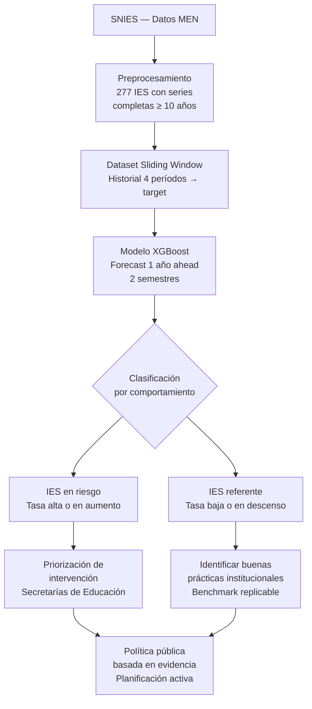

# Forecast de Deserción en Instituciones de Educación Superior — Colombia

Modelo de machine learning que predice la tasa de deserción estudiantil por IES para los dos semestres siguientes (1 año adelante), usando series históricas del SNIES.

---

## Flujo del proyecto



---

## Contexto y problema

La deserción estudiantil en la educación superior colombiana es uno de los principales retos del sistema educativo. Según los datos del Ministerio de Educación Nacional, una proporción significativa de los estudiantes que ingresan a una IES no logra graduarse, con impactos directos en la movilidad social, el retorno a la inversión pública en educación y la sostenibilidad de las instituciones.

Históricamente, las entidades de gobierno han respondido a este fenómeno de forma **reactiva**: se detecta el problema cuando ya ocurrió. Este proyecto busca cambiar ese paradigma.

---

## Contexto de política pública

Las secretarías de educación y el Ministerio de Educación Nacional operan dentro de ciclos de gobierno con ventanas de planificación anuales. Para que una secretaría pueda diseñar e implementar una intervención efectiva en una IES —ya sea acompañamiento, asignación de recursos o alertas tempranas— necesita anticipar el comportamiento con al menos un año de antelación.

Un modelo que prediga la tasa de deserción para los próximos dos semestres permite:

- **Pasar de reactivo a activo**: identificar qué IES están en riesgo antes de que el problema escale
- **Priorizar intervenciones**: enfocar recursos en las instituciones con mayor probabilidad de deterioro
- **Planificar dentro del ciclo de gobierno**: las predicciones a 1 año se alinean con los ciclos de presupuesto y política educativa

Se descartó un horizonte de 2 años porque la incertidumbre acumulada reduce significativamente la confiabilidad de las predicciones, y el valor de negocio se concentra en el año inmediato. Adicionalmente, los datos del SNIES presentan limitaciones de consistencia en el reporte —tasas con artefactos, cobertura variable entre IES y ausencia de variables de contexto institucional— que hacen poco confiable extender el horizonte más allá de un año. La proyección a 1 año es la propuesta más honesta dado el nivel de información disponible.

---

## Objetivo

Predecir la **tasa de deserción por IES** para los semestres `t+1` y `t+2` (el año siguiente), a partir de su historial de al menos 10 años de datos consecutivos.

---

## Datos

- **Fuente**: Sistema Nacional de Información de la Educación Superior (SNIES) — Ministerio de Educación Nacional
- **Cobertura**: 343 IES con datos históricos en el sistema
- **IES aptas para forecast**: 277 instituciones seleccionadas con series consecutivas de **mínimo 20 períodos (10 años)** sin huecos internos
- **Variable objetivo**: tasa de deserción = `(DESERTORES / MATRICULADOS) × 100`, acotada a [0, 100] para corregir artefactos de reporte del SNIES donde DESERTORES puede provenir de cohortes distintas a MATRICULADOS

---

## Metodología

El pipeline se divide en tres etapas:

### 1. Preprocesamiento (`dataset.ipynb`)
- Consolidación de registros por IES y período, sumando sexos con preservación de valores faltantes reales
- Diagnóstico de cobertura para identificar las 277 IES con series completas
- Construcción del dataset de entrenamiento mediante **ventana deslizante**: cada fila representa una posición en la serie histórica con 4 períodos anteriores como entrada y el siguiente período como objetivo

### 2. Entrenamiento (`entrenamiento_csv/model.ipynb`)
- **Modelo**: XGBoost Regressor con enfoque recursivo — un único modelo predice un paso adelante; para obtener la predicción del segundo semestre se encadena la salida del primero como entrada
- **Split temporal**: Train ≤ 2023-1 | Validación = 2023-2 | Test = 2024
- **Optimización**: Optuna con 100 ensayos buscando los mejores hiperparámetros sobre el set de validación
- **Features**: últimos 4 períodos de tasa (`lag1`–`lag4`), semestre, carácter institucional, origen, departamento y municipio

### 3. Evaluación
- Métricas principales: **MAE** (error promedio en puntos porcentuales) y **RMSE** (penaliza errores grandes)
- La relación RMSE/MAE indica consistencia del modelo: valores cercanos a 2 son saludables; valores mayores a 3 señalan casos problemáticos que requieren revisión

---

## Resultados

Evaluación sobre el set de test (año 2024, datos **no vistos durante entrenamiento ni optimización**). Los hiperparámetros se seleccionan con Optuna **sobre el set de validación** (2023-2) y el test se mide **una sola vez** con el modelo ya congelado:

| Métrica | Valor (test 2024) |
|---------|-------------------|
| RMSE    | 10.14 |
| MAE     | 4.31  |
| Ratio RMSE/MAE | 2.35 |

> **Nota de transparencia (corrección de metodología).** Una versión previa reportaba RMSE 9.48 / MAE 4.23, pero esa cifra se obtuvo con Optuna optimizando los hiperparámetros sobre el propio conjunto de **test** (*data leakage* de selección). Corregido el protocolo (selección por validación, test medido una sola vez con `TPESampler(seed=42)` para reproducibilidad), el número honesto es **RMSE 10.14 / MAE 4.31**. Es ligeramente peor, pero es el desempeño real esperable sobre IES no vistas.

**Interpretación para el negocio**: en promedio, el modelo se equivoca **4.31 puntos porcentuales** al predecir la tasa de deserción de una IES. Como referencia, un baseline trivial de **persistencia** (predecir que la tasa se mantiene igual a la del último semestre) obtiene RMSE 10.07 / MAE 4.42 sobre el mismo test agregado. Para una comparación justa conviene mirar el desempeño **por horizonte** (abajo).

### Evaluación honesta por horizonte (forecast recursivo)

El producto promete un pronóstico a un año emitido en un único corte (fin de 2023-2). Bajo ese uso, al predecir 2024-2 **no se conoce** la tasa real de 2024-1: se usa la *predicción* de 2024-1 como `lag1` (encadenamiento recursivo). Reportar la métrica por horizonte y compararla contra la persistencia equivalente es lo metodológicamente correcto:

| Horizonte | Modelo (RMSE / MAE) | Persistencia (RMSE / MAE) |
|-----------|---------------------|---------------------------|
| **t+1** (2024-1) | **11.16 / 4.74** | 11.48 / 4.97 |
| **t+2** (2024-2, recursivo) | **10.49 / 4.72** | 11.19 / 4.72 |
| t+2 (2024-2, con `lag1` real — *protocolo anterior, optimista*) | 8.99 / 3.89 | — |

Dos conclusiones: (1) **el modelo supera a la persistencia en ambos horizontes** cuando se le mide de forma justa (≈0.3 RMSE en t+1, ≈0.7 en t+2); (2) usar la tasa **real** de 2024-1 (en vez de la predicha) hacía que t+2 pareciera mucho mejor de lo que honestamente es (RMSE 8.99 vs 10.49) — ese era el *leakage temporal* ahora corregido con la evaluación recursiva.

### Comparación contra baselines (mismo protocolo y splits)

| Modelo / Baseline | VAL (RMSE / MAE) | TEST agregado (RMSE / MAE) |
|-------------------|------------------|----------------------------|
| **XGBoost** (Optuna sobre validación) | **4.36 / 2.81** | 10.14 / 4.31 |
| Persistencia (`lag1`) | 8.18 / 3.15 | 10.07 / 4.42 |
| Media (`y_train`) | 7.38 / 5.74 | 13.51 / 7.59 |

En **validación** el modelo supera ampliamente a la persistencia; en el **test agregado** prácticamente empata (las tasas de deserción son muy persistentes, así que "repetir el último valor" es un rival fuerte). La ventaja real del modelo se ve sobre todo (a) en la evaluación **por horizonte** (tabla anterior, donde gana en t+1 y t+2) y (b) potencialmente en la **priorización/ranking** de IES en riesgo. La gran brecha validación→test confirma la necesidad de **backtesting multi-ventana** (un solo semestre de validación no es representativo).

---

## Estructura del proyecto

```
├── dataset.ipynb                  # Preprocesamiento y construcción del dataset
├── EDA_preprocesamiento.ipynb     # Análisis exploratorio de datos
├── df_forecast_raw.csv            # Dataset consolidado de las 277 IES aptas
├── entrenamiento_csv/
│   ├── model.ipynb                # Entrenamiento, optimización y evaluación
│   ├── X_train.csv                # Features de entrenamiento
│   ├── X_val.csv                  # Features de validación
│   ├── X_test.csv                 # Features de test
│   ├── y_train.csv                # Targets de entrenamiento
│   ├── y_val.csv                  # Targets de validación
│   └── y_test.csv                 # Targets de test
└── MEN_*.csv                      # Datos fuente del SNIES
```

---

## Cómo reproducir

### Requisitos

```bash
pip install pandas numpy xgboost scikit-learn optuna matplotlib seaborn
```

### Orden de ejecución

1. **`dataset.ipynb`** — Ejecutar todas las celdas en orden. Genera `df_forecast_raw.csv` y los archivos CSV en `entrenamiento_csv/`
2. **`entrenamiento_csv/model.ipynb`** — Ejecutar todas las celdas en orden. Carga los CSV, entrena el modelo y evalúa en test

> Los datos fuente (`MEN_*.csv`) deben estar en la raíz del proyecto. Se obtienen directamente del portal del SNIES — Ministerio de Educación Nacional de Colombia.

---

## Próximos pasos

- Feature engineering: tendencia (`lag1 - lag4`), momentum (`lag1 - lag2`), volatilidad de la serie
- Dashboard interactivo para visualización de predicciones por IES y departamento
- Incorporación de variables externas: tasas de desempleo regional, indicadores socioeconómicos
